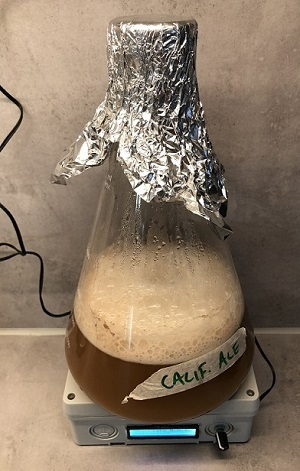
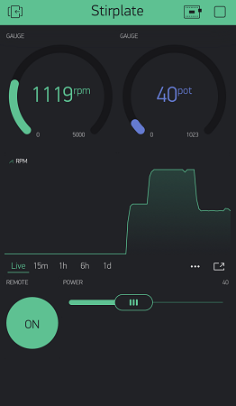
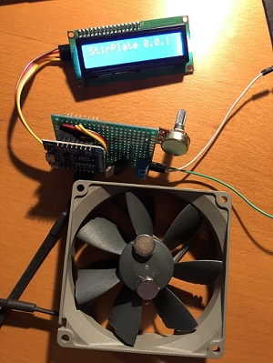
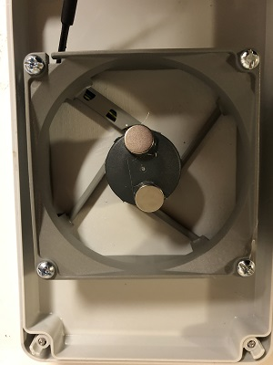

# PWM controlled stirplate with remote control

I decided to build my own stirplate and I wanted to use a PWM controlled fan for optimal performance. This also enabled me to measure the RPM of the fan. I'm using this build for my yeast starter (Beer brewing).

Since I had a few ESP8266 controller this was the natual choise to use... Since there is built in wifi, one needs to use this. This first version can use a local Blynk server in order to display the RPM and also control the FAN from the app. 



## Versions

* 0.2.0 First version that is published on github
* 0.3.0 Some minor refactoring + OTA update from local web server.

## How it works

I use a potentimeter (5k) to control the speed, this is read via the Analog input (A0) on the ESP (note that this is limited to max 3.3V) so if it's powered by 5V a voltage divider must be used (R1 is used to limit the input to 3.3V). 

D5 is used to generate the PWM signal to the FAN and D6 is used to monitor the RPM via interrupt. So the basic design is quite simple. D1 and D2 are used for communicating with the LCD display.

I have created a few classes to encapsulate the display, analog sensor, pwm control, blynk interface. This also enables me to simualate some of the functionallity without connecting all the cables. This simplifies the development. Just make sure you build the release target when flashing since the debug version use the simulated inputs for sensor and rpm.

## Configuration/Build

In order to compile the project and use WIFI/Blynk functionallity to work you need to create a file called src/mysecrets.h which contains your personal wifi and blynk settings. I used a local blynk server to minimize the latency/update speed. The code submits new data every 500ms. If you intend to use the blynk cloud it might be neccesary to update the code to submit data more seldom.

This is what this file should contain. 
```
#ifndef _MYSECRETS_H
#define _MYSECRETS_H

#define WIFI_SECRET_AP  "wifi name"
#define WIFI_SECRET_PWD "wifi password"
#define BLYNK_TOKEN     "token"
// IP adress of local blynk server, should listen to 8080 by default.
#define BLYNK_SERVER    IPAddress(192,168,1,1)      
#define BLYNK_PORT      8080
#define OTA_HTTP        "http://192.168.1.16/firmware/stirplate/"     

#endif // _MYSECRETS_H
```

The following defintions can be used to enable/disable parts of the code

* ACTIVATE_BLYNK    Include blynk code in build (requires wifi)
* ACTIVATE_OTA      Include ota code in build (requires wifi)
* ACTIVATE_WIFI     Include wifi access in build 
* LOG_LEVEL=6       Configure Arduino Log (6=Debug, 5=Trace, 4=Notice, 3=Warning, 2=Error, 1=Fatal, 0=Silent)
* SIMULATE_SENSOR   Used to simulate pot readings
* SIMULATE_RPM      Used to simulate pwm readings
* DISPLAY_SELFTEST  Runs some tests on the display at startup

## OTA function

From version 0.3.0 I have added the possibility to do updates via OTA from a local web server over port 80. 

For this to work, place the following files (version.json + firmware.bin) at the location that you pointed out in the mysecrets.h file. If the version number in the json file is newer than in the code the update will procced.

Contents version.json
```
{ "project":"stirplate", "version":"0.3.0" }
```

## Blynk Sensors

Currently the code uses the following virtual sensors to interact with blynk

* V0 - Output - Fan RPM 
* V1 - Output - Potentiometer Fan Power in %
* V2 - Input  - Activate remote control (if = 1, it will use V3 to control the speed)
* V3 - Input  - Remote Fan Power in %
* V4 - Output - Version string



## Materials

In order to build this project you will need the following;

* U1 - Microcontroller ESP8266
* U2 - I2C compatible display - I used a 2x16 LCD
* U3 - Power regulator 12V -> 5V 1A - I used L4940V5 TO-220
* R1 - Resistor 2.2k 
* R2 - Potentiometer 5k
* R3 - Resistor 3.3k
* Board for mounting components
* FAN with PWM (4-pin) - I used Noctua NF-B9 rexux 1600 
* Box large enough to hold the FAN and electronics
* Power supply 12VAC - 1A
* 2 neodym magnets (glued to fan)

A schematics that I used can be found in the cad directory. [Electronic schema](cad/schema.pdf)



On my build I cut of the wings to the FAN, this increased the maximum RPM from 1800 -> 2700. I glued the fan to the box lid,, just make sure there is enough distance for the fan to spin. 



Feel free to use the code and modify your own build. 

Happy building. /Magnus 