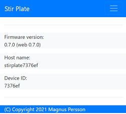

# PWM controlled stir plate for Beer Brewing

I decided to build my own stir plate and I wanted to use a PWM controlled fan for optimal performance, which requires a microcontroller, since the esp8266 are quite cheap and I happend to have a few lying around this was the natural selection. This also enabled me to measure RPM of the fan and integrate with other things. I'm using this build for my yeast starters with good result and stability. Tests shows that this setup can handle a starter for up to 3 liters (I dont have a bigger glass vessel to test with). The first extension was to add a temperature probe so I can keep track of the wort temperature as well. 

This version can communicate with Blynk server and other software that can handle a standard http post request. With blynk it's also possible to remote control the device and change the power if needed (do override on the potentiometer).


Here is a short video that shows the minimum and maximum speed with a 3 liter starter. The slow speed is around 150 RPM and max speed is 1400 RPM.

[Video of running stir plate](img/speed.mov)

## How does the hardware work ?

I use a potentimeter (5k) to control the speed, this is read via the Analog input (A0) on the ESP (note that this is limited to max 3.3V) so if it's powered by 5V a voltage divider must be used (R1 is used to limit the input to 3.3V). This is mapped towards a PWM signal that is generated by the microcontroller. D5 is used to generate the PWM signal to the FAN and D6 is used to monitor the RPM via interrupt. So the basic design is quite simple. D1 and D2 are used for communicating with the LCD display via I2C.

There are 2 defined targets in the platformIO configuration

* Release with WIFI (firmware.bin)
* Debug version uses simualated values to simplify development.

## Version changes

v1.1.0 - Updated dependences migrated to use my common espfwk, removed blynk and http post.
v1.0.2 - Updated dependences and switched back to 2.6.3, fixed minor compiler issues
v1.0.1 - Forcing wifi into client mode, minor update to support ESP8266 SDK v3.0.0
v1.0.0 - First release 

## Todo

This is a list of possible updates that i might implement in the future.
* Change log settings from UI, this is today set in the platform.ini (compile time).
* Additional push targets, influxdb.

## Installation

You can use VisualStudio Code + Platform IO to handle the device flashing. 

An option could be to use this tool; https://github.com/marcelstoer/nodemcu-pyflasher
Binaries for this is located in the bin folder. 

## Setup

The wifi version will create an WIFI access point at startup called StirPlate (password=password) unless the device has valid wifi settings. A double tap on the reset button will force the device into wifi setup mode. In the portal you can also set the network name of the device (mDNS name). This will have the suffix .local

Once the device is on the wifi network it will have a running webserver that can be used to configure the device. The default name of the device will be __stirplateXXXXX.local__ unless changed in the wifi settings. Use mDNS name or just use the dynamic IP to access the portal. IP adress will be displayed in the serial output from the device during startup. XXXXX is the chip ID and will be 6 characters and uniqe for that device (eg 7a84DC).

### Index


The first page will show information about the operation of the device, RPM, Temperature and Power setting.

### Device



Device page will show current version and device information.

### Configuration

Configuration is used to change the setup and is divided into 4 catagories, Device, Push, Blynk and Hardware.


The settings that can be changed are the following;

* Device name; this is the mDNS (network) name of the device.
* Temperature format; select in which format the temperature value is displayed (Celcius or Farenheigt)
* HTTP Push; URL for posting data (See section below on format details)
* Push Interval; How often should the data be submitted (in seconds)
* Blynk server; Name or IP of the local blynk server. If left empty the blynk cloud will be used.
* Blynk server port; Port for the local blynk server, ignored if blynk cloud is used.
* Blynk token; Token connected to the blynk application, if empty blynk will be disabled.
* Temp sensor adjustment; If you feel that the tempsensor is not showing the correct temperature it's possible to enter a value that will adjust the presented temperature. 
* OTA base URL; OTA base url (use a local webserver since SSL is not used). See section below on more details.

## Build Configuration

I prefer to use Visual Studio Code with the extension PlatformIO which makes it quite easy to make a build.

Development related settings (so I dont have to have a fully working setup)

* LOG_LEVEL=6       Configure Arduino Log (6=Debug, 5=Trace, 4=Notice, 3=Warning, 2=Error, 1=Fatal, 0=Silent)
* SIMULATE_SENSOR   Used to simulate pot readings
* SIMULATE_TEMP     Used to simulate temp readings
* SIMULATE_RPM      Used to simulate pwm readings
* DISPLAY_SELFTEST  Runs some tests on the display at startup

## OTA function

I have added the possibility to do updates via OTA from a local web server over port 80. 

For this to work, place the following files (version.json + firmware.bin) at the location that you pointed out in OTA URL. If the version number in the json file is newer than in the code the update will be done during startup.

Example; OTA URL (don't forget trailing dash), the name of the file should be firmware.bin
```
http://192.168.4.1/firmware/stirplate/
```

Contents version.json
```
{ "project":"stirplate", "version":"0.3.0" }
```

## Materials

In order to build this project you will need the following;

Schema and PCB is avaialble under the cad folder, these are designed in Eagle (Free version) and can be downloaded from Autodesk. Note! That these are not yet tested and verified. For my build I used a standard breadbord. 

* U1 - Microcontroller ESP8266 (WEMOS D1 Mini)
* IC1- DS28B20 (Temperature probe)
* IC2- Power regulator 12V -> 5V (I used LD1085V50)
* R1 - Resistor 3.3k 
* R2 - Potentiometer 5k
* R3 - Resistor 3.3k
* R4 - Resistor 4.7k
* C1 - 10uF
* C2 - 10uF
* 2 x 4PIN connectors for display and fan.
* I2C compatible display - I used a 2x16 LCD
* PCB for mounting components
* FAN with PWM (4-pin) - I used Noctua NF-B9 rexux 1600 
* Box large enough to hold the FAN and electronics
* Power supply 12VAC - 1A
* 2 neodym magnets (glued to fan)

A schematics that I used can be found in the cad directory. [Electronic schema](cad/stirplate.pdf)

There is also a PCB example that has not yet been verified.


On my build I cut of the wings to the FAN, this increased the maximum RPM from 1800 -> 2700. I glued the fan to the box lid with some spacers to make sure there is enough distance for the fan to spin. 


Feel free to use the code and modify your own build. Contributions and ideas for improvements are welcomed.

Happy building. 
/Magnus 